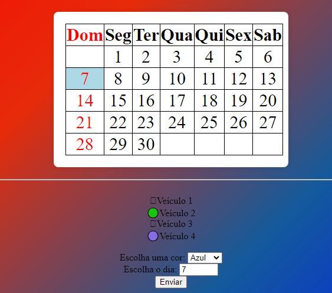

# indice

* [Descrição](#descri%C3%A7%C3%A3o)

* [Funcionalidades](#funcionalidades)

* [Fontes utilizadas ](#fontes-utilizadas)

* [Autores](#autores)

## descrição
Site com objetivo de marcar os dias do mes de abril para marcar eventos por exemplo

## funcionalidades
* marcar eventos, festas de aniversário, shows, etc.

## fontes utilizadas
* inteligencia artificial chat gbt.
* encinamentos do professor [Leonardo](https://github.com/leonardorochamarista)

### tecnologias utilizadas
 * git hub
 * google

## autores
* Cristian Tayler